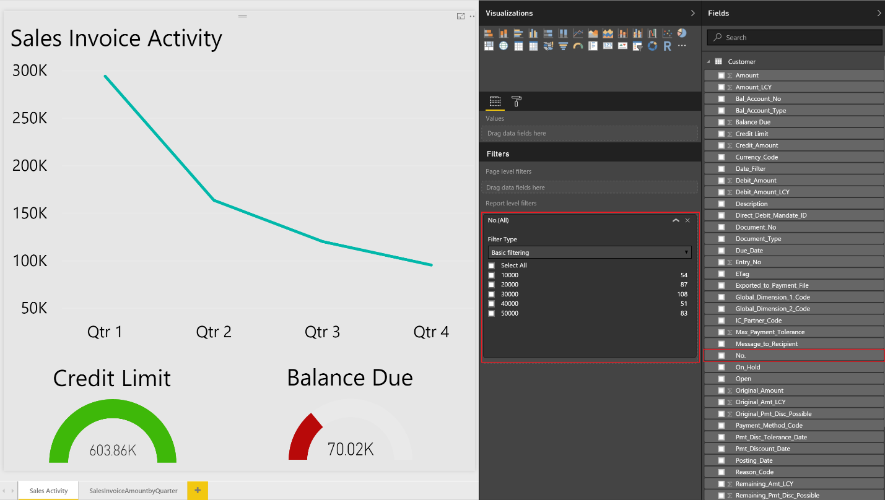
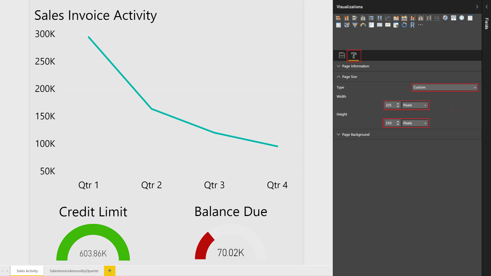

# Power BI -raporttien luettelotietojen tarkasteleminen Dynamics NAV -ohjelmassa
[!INCLUDE[d365fin](includes/d365fin_md.md)]in useilla tärkeillä luettelosivuilla on ohjauselementtinä tietoruutu, jolla saa lisätietoja luettelon tiedoista. Raportti päivitetään ja suodatetaan valitun tapahtuman mukaan, kun siirryt luettelon riveillä. Voit luoda mukautettuja raportteja, joissa tämä ohjausobjekti on esillä. Raportteja luotaessa on kuitenkin noudatettava tiettyjä sääntöjä, jotta ne toimisivat halutulla tavalla.  

> [!NOTE]  
>   Sinulla on oltava kelvollinen [!INCLUDE[d365fin](includes/d365fin_md.md)]- ja Power BI -tili. Sinun on ladattava myös [Power BI Desktop](https://powerbi.microsoft.com/en-us/desktop/). Lisätietoja on kohdassa [[!INCLUDE[d365fin](includes/d365fin_md.md)]in käyttäminen Power BI -tietolähteenä](across-how-use-financials-data-source-powerbi.md).  

## Raportin tietojoukko
Kun luot raportin Power BI Desktopissa, sinun on määritettävä tietolähde tai verkkopalvelu, joka sisältää siihen luetteloon liittyvät tiedot, johon haluat liittää raportin. Jos haluat esimerkiksi luoda myyntiluetteloa koskevan raportin, varmista, että tietojoukko sisältää myyntiin liittyviä tietoja.  

Jos haluat suodattaa raporttien tietoja luettelosivulta valitun tietueen perusteella, raportin suodattimena on käytettävä perusavainta. Perusavaimien on oltava osa tietojoukkoa, jotta raportti voidaan suodattaa oikein. Useimmissa tapauksissa luettelon perusavain on **Nro** -kentässä.  

## Raporttisuodattimen määrittäminen
Raportissa on oltava perusraporttisuodatin (ei sivu-, visuaalinen eikä lisäsuodatus), jotta suodatus tapahtuu oikein Power BI:n tietoruutuohjausobjektissa. Power BI -raporttiin kultakin luettelosivulta siirrettävä suodatin perustuu perusavaimeen edellisessä osassa kuvatulla tavalla.  

Voit määrittää raporttisuodattimen valitsemalla käytettävissä olevien kenttien luettelosta perusavaimen sekä vetämällä ja pudottamalla kyseisen kentän **Raporttisuodatin**-kenttään.  

## Raportin koko ja väri
Raportin kooksi on määritettävä 325 x 310 kuvapistettä. Tämä on välttämätöntä, jotta raportin voi skaalata oikein Power BI:n tietoruutuohjausobjektin sallimassa tilassa. Voit määrittää raportin koon viemällä kohdistuksen raportin asettelualueen ulkopuolelle ja valitsemalla maalitelakuvakkeen.

Voit muuttaa raportin leveyttä ja korkeutta valitsemalla **Tyyppi**-kentässä **Mukautettu**.

Jos vastaavasti haluat, että raportin tausta sekoittuu Power BI:n tietoruutuohjausobjektin taustaväriin, määritä mukautetun raportin taustaväriksi *E5E5E5*. Tämä on vapaaehtoinen.  

## Useita sivuja sisältävät raportit
Voit luoda Power BI:ssa yhden raportin, jossa on useita sivuja. [!INCLUDE[d365fin](includes/d365fin_md.md)]in luettelosivulla näkyvien visualisointien on oltava Power BI:n raporttien ensimmäisellä sivulla.  

> [!NOTE]  
>  Power BI:n tietoruutu voi näyttää vain raportin ensimmäisen sivun. Jos haluat nähdä muut sivut, laajenna raportti ja siirry muille sivuille raportin alareunassa olevien välilehtien avulla.  

## Raportin tallentaminen

Raporttia tallennettaessa on parhaan käytännön mukaista käyttää raportin nimessä sen luettelosivun nimeä, jossa haluat näyttää raportin. Esimerkki: *Toimittaja*-sanan on sisällyttävä niiden raporttien nimiin, jotka ovat käytettävissä toimittajaluettelossa.  

Vaikka tämä ei ole välttämätöntä, se helpottaa raporttien valitsemista. Kun raportin valintasivu avataan luettelosivulta, suodatin siirretään sivun nimen perusteella rajoittamaan näytettäviä raportteja.  Voit poistaa suodattimen, jos haluat luettelon kaikista käytössäsi olevista Power BI:n raporteista.  

## Vianetsintä
Tässä osassa esitellään tapa, jolla voidaan kiertää tavallisimmat Power BI -raportin luomiseen liittyvät ongelmat.  

**Käyttäjä ei näe Valitse raportti -sivulla raporttia, jonka he haluavat valita** Jos et voi valita raporttia, raportin nimi kannattaa tarkistaa ja varmistaa, että se sisältää luettelosivun nimen. Voit myös tyhjentää suodattimen, jos haluat luettelon kaikista käytössä olevista Power BI:n raporteista.  

**Raportti on ladattu, mutta se on tyhjä, suodattamaton tai virheellisesti suodatettu** Tarkista, että raporttisuodatin sisältää oikean perusavaimen. Useimmissa tapauksissa se on **Nro**-kenttä, esimerkiksi **KP-tapahtuma**-kentässä on käytettävä **Tapahtumanro**-kenttää.

**Raportti on ladattu, mutta näkyvissä ei ole odotettu sivu** Tarkista, että näytettävä sivu on raportin ensimmäinen sivu.  

**Raportissa on tarpeettomat harmaat rajat tai se on liian pieni tai suuri**

Tarkista, että raportin kooksi on määritetty 325 x 310 kuvapistettä. Tallenna raportti ja päivitä sitten luettelosivu.  

## Katso myös
[[!INCLUDE[d365fin](includes/d365fin_md.md)]in käyttäminen Power BI -tietolähteenä](across-how-use-financials-data-source-powerbi.md)  
[Tervetuloa [!INCLUDE[d365fin_long](includes/d365fin_long_md.md)]iin!](index.md)    
[[!INCLUDE[d365fin](includes/d365fin_md.md)]in määrittäminen](setup.md)    
[Rahoitus](finance.md)  

